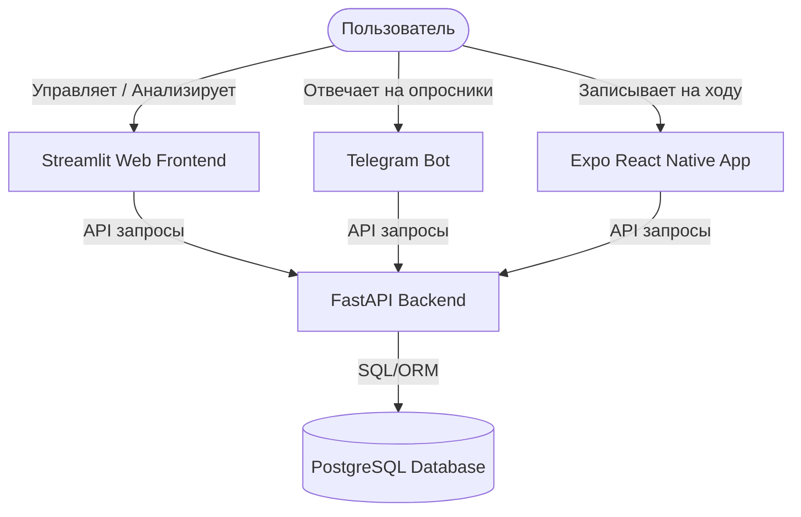

# Обзор проекта: Personal Analytics System (Система Личной Аналитики)

Этот документ содержит полное техническое и функциональное описание проекта. Вы можете передать его любому AI-агенту (разработчику, аналитику данных или архитектору) для быстрого введения в курс дела и начала совместной работы.

---

## 1. Основная идея и философия

**Главный девиз:** *«То, что нельзя измерить, нельзя улучшить».*

**Идея проекта:**  
Создать комплексную, полностью контролируемую пользователем (self-hosted) экосистему для сбора, хранения и глубокого анализа данных о качестве жизни. Система собирает количественные и качественные метрики из всех ключевых областей (здоровье, физическая активность, финансы, продуктивность, обучение и психологическое состояние) и предоставляет инструменты для поиска скрытых взаимосвязей, проведения строгих научных A/B-экспериментов и отслеживания долгосрочных целей.

---

## 2. Архитектура и стек технологий

Система разворачивается локально с помощью **Docker Compose** и состоит из 4 основных сервисов:

### Стек технологий:
*   **СУБД:** PostgreSQL (основное хранилище данных).
*   **Backend:** Python 3.11+ / FastAPI (REST API) / SQLAlchemy (ORM).
*   **Web-Frontend:** Python / Streamlit (интерактивные графики, дашборды, формы ввода).
*   **Mobile App:** React Native / Expo (компоненты на TypeScript, файловый роутинг).
*   **Telegram Bot:** Python / API Telegram (пошаговый планировщик опросов через APScheduler).
*   **Инфраструктура:** Docker, Docker Compose, `pg_dump` для регулярных резервных копий.

---

## 3. Функциональные модули и домены данных

Данные разделены на логические таблицы в БД. Каждая сущность привязана к дате (`date` или `datetime`), что позволяет объединять их во времени.

### A. Ежедневные логи и субъективное состояние (`DailyLog`, `DailySupplement`, `DailyNutrition`)
*   **Функционал:** Опросник субъективного состояния дня (настроение от 1 до 10, сон, шаги, тренировки, выпитый кофе/вода, порции овощей/фруктов, вредная еда).
*   **Специфика:** Поле `diary_text` (дневник) собирает свободный текст для последующего NLP-анализа (например, корреляция тональности текста с качеством сна).
*   **БАДы:** Возможность точечного учета дозировок принимаемых добавок (как стандартных из списка вроде Vitamin D3, Omega 3, Creatine, Glycine, L-theanine, multivitamins, так и пользовательских).

### B. Силовые тренировки (`StrengthWorkout`, `WorkoutSet`)
*   **Функционал:** Полноценный журнал силовых тренировок с разбивкой на упражнения, подходы, вес, количество повторений и оценку RPE (субъективное усилие).

### C. Финансы (`Finance`)
*   **Функционал:** Учет транзакций по трем типам: `Expense` (расходы), `Income` (доходы) и `Saving` (сбережения) с разбивкой по категориям и текстовым описанием.

### D. Обучение и Работа (`LearningLog`, `DailyLog.work_hours`)
*   **Функционал:** Логирование времени, затраченного на теорию (learning) и практику (practice) по конкретным темам, а также учет отработанных за день часов.

### E. Биометрия и Анализы (`GlobalMetric`, `MedicalTest`)
*   **Функционал:** 
    *   Редкие метрики (`VO2Max`, `HRV`, `Weight`, результаты тестов IQ/MBTI) в `GlobalMetric`.
    *   Медицинские анализы крови в `MedicalTest` с фиксацией названия маркера, полученного значения, единицы измерения и референсных значений лаборатории.

### F. Постановка целей (`Goal`)
*   **Функционал:** Трекер целей по сферам жизни с указанием целевых метрик, сроков и текущего статуса (`Active`, `Completed`, `Failed`).

---

## 4. Продвинутый аналитический и научный функционал

Проект выходит за рамки обычного трекера привычек благодаря двум ключевым возможностям:

### 1. Единый датасет для Машинного Обучения (`/api/ml/dataset`)
Эндпоинт собирает данные из **всех** таблиц БД, транспонирует (pivot) динамические списки (БАДы, финансы, темы обучения, анализы) в столбцы и выдает плоскую денормализованную таблицу по датам.
*   *Зачем это нужно:* Этот датасет идеально подходит для прямой загрузки в Pandas/Scikit-Learn для обучения моделей регрессии (например, прогнозирования настроения на основе сна, БАДов и шагов за предыдущие дни) или автоматического поиска корреляций.

### 2. Модуль Научных Экспериментов (`/api/experiments/analyze` & Streamlit-страница 8)
Позволяет проводить мини-исследования (например, «Влияние матчи вместо кофе на HRV» или «Влияние медитации на настроение») по двум дизайнам: **До/После (Pre-Post)** или **Случайные A/B дни (Randomized)**.
*   **Расчет мощности (Power Analysis):** Перед стартом система рассчитывает необходимый объем выборки (количество дней) на основе MDE (минимально обнаруживаемого эффекта) и исторического стандартного отклонения метрики.
*   **Автоматические стат-тесты:**
    1.  Проверяет распределения групп на нормальность (критерий Шапиро-Уилка).
    2.  Проверяет равенство дисперсий (критерий Левена).
    3.  Автоматически выбирает наиболее подходящий критерий: параметрический (T-тест Стьюдента/Уэлча) или непараметрический (Манна-Уитни U).
    4.  Счет размер эффекта (Cohen's d) и относительные изменения.
    5.  Запускает **Bootstrap-моделирование** (2000 симуляций) для построения эмпирических доверительных интервалов.

---

## 5. Чем агент может помочь в этом проекте?

Любой новый AI-агент может эффективно подключиться к следующим задачам:

### 🛠 Разработка и расширение функционала (Coding):
1.  **Backend (FastAPI):**
    *   Написание новых эндпоинтов для анализа данных (например, расчет скользящих средних, выявление трендов).
    *   Добавление интеграций с внешними API (Apple Health, Google Fit, Telegram, банковские API для автоимпорта расходов).
    *   Оптимизация SQL-запросов и структуры БД.
2.  **Frontend (Streamlit):**
    *   Создание новых интерактивных дашбордов с использованием Plotly (например, дашборд корреляционного анализа).
    *   Улучшение UX форм ввода данных.
3.  **Mobile App (React Native/Expo):**
    *   Создание недостающих экранов (например, просмотр графиков финансов, логов тренировок).
    *   Настройка локальных пуш-уведомлений-напоминаний.
4.  **Telegram Bot:**
    *   Добавление новых команд (например, быстрый вывод сводки за неделю `/summary`).
    *   Поддержка ввода свободных расходов через текстовый парсинг.

### 📊 Анализ данных и ML (Data Science):
*   Написание Jupyter-ноутбуков для исследования корреляций со сдвигом по времени (lag-эффекты: например, как тренировка в понедельник влияет на сон во вторник и работу в среду).
*   Реализация NLP-моделей для сентимент-анализа дневниковых записей.
*   Построение прогностических моделей самочувствия.

### ⚙ DevOps и Администрирование:
*   Настройка автобэкапов базы данных на внешние облачные диски.
*   Добавление тестов (PyTest для бэкенда, Jest для мобильного приложения).
